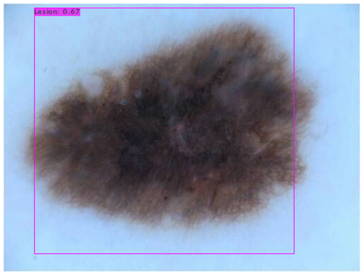
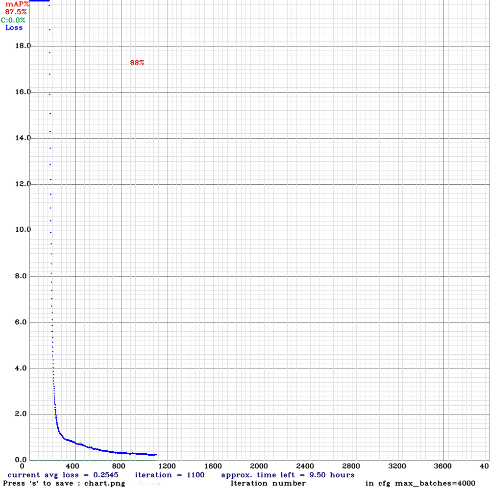
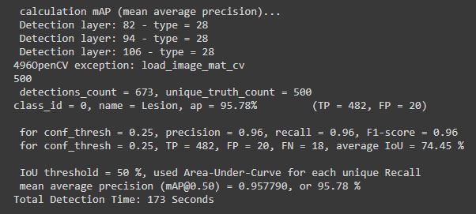

<a rel="license" href="http://creativecommons.org/licenses/by-nc/4.0/"></a><br />This work is licensed under a <a rel="license" href="http://creativecommons.org/licenses/by-nc/4.0/">Creative Commons Attribution-NonCommercial 4.0 International License</a>.

# Skin Lesion detection using YOLO

This project deals with the detection of skin lesions within the ISICs dataset using YOLOv3 Object Detection with Darknet.



## YOLOv3

**YOLO** stands for "You Only Look Once" which uses Convolutional Neural Networks for Object Detection. On a single image, YOLO may detect multiple objects. It implies that, in addition to predicting object classes, YOLO also recognises its positions in the image. The entire image is processed by a single Neural Network in YOLO. The picture is divided into regions using this Neural Network, which generates probabilities for each region. YOLO predicts multiple bounding boxes that cover some regions of the image and then based on the probabilities, picks the best one.

### Architecture of YOLOv3:


- YOLOv3 has a total of 106 layers where detections are made at 82, 94 and 106 layers.
- It consists of a residual blocks, skip connections and up-sampling.
- Each convolutional layer is followed by batch normalization layer and Leaky ReLU activation function.
- There are no pooling layers, but instead, additional convolutional layers with stride 2, are used to down-sample feature maps.

## Input:

Input images themselves can be of any size, there is no need to resize them before feeding to the network. However, all the images must be stored in a single folder. In the same folder, there should be a text file, one for each image(with the same file name), containing the "true" annotations of the bounding box in YOLOv3 format i.e.,

```
<class id> <Xo/X> <Yo/Y> <W/X> <H/Y>
```

where,

- class id = label index of the class to be annotated
- Xo = X coordinate of the bounding box’s centre
- Yo = Y coordinate of the bounding box’s centre
- W = Width of the bounding box
- H = Height of the bounding box
- X = Width of the image
- Y = Height of the image

For multiple objects in the same image, this annotation is saved line-by-line for each object.

## Steps:

> **Note:** I have used Google Colab which supports Linux commands. The steps for running it on local windows computer is different.

1. Create "true" annotations using **Annotate_YOLO.py** which takes in segmented(binary) images as input and returns text file for every image, labelled in the YOLO format.

2. Clone darknet from AlexeyAB's GitHub repository, adjust the Makefile to enable OPENCV and GPU and then build darknet.

   ```sh
   # Clone darknet repo
   !git clone https://github.com/AlexeyAB/darknet

   # Change makefile to have GPU and OPENCV enabled
   %cd darknet
   !chmod +x ./darknet
   !sed -i 's/OPENCV=0/OPENCV=1/' Makefile
   !sed -i 's/GPU=0/GPU=1/' Makefile
   !sed -i 's/CUDNN=0/CUDNN=1/' Makefile
   !sed -i 's/CUDNN_HALF=0/CUDNN_HALF=1/' Makefile

   # To use the darknet executable file
   !make
   ```

3. Download the pre-trained YOLO weights from darknet. It is trained on a coco dataset consisting of 80 classes.

   ```sh
   !wget https://pjreddie.com/media/files/darknet53.conv.74
   ```

4. Define the helper function as in **Helper.py** that is used to display images.

5. Split the dataset into train, validation and test set (including the labels) and store it in darknet/data folder with filenames "obj", "valid", and "test" repectively. In my case, total images = 2594 out of which,

   > Train = 2094 images; Validation = 488 images; Test = 12 images.

6. Create **obj.names** consisting of class names (one class name per line) and also create **obj.data** that points to the file paths of train data, validation data and backup folder which will store the weights of the model trained on our custom dataset.

7. Tune hyper-parameters by creating custom config file in "cfg" folder which is inside "darknet" folder. Change the following parameters in **yolov3.clf** and save it as **yolov3-custom.cfg**:

   The parameters are chosen by considering the following:

   ```
   - max_batches = (# of classes) * 2000 --> [but no less than 4000]

   - steps = (80% of max_batches), (90% of max_batches)

   - filters = (# of classes + 5) * 3

   - random = 1 to random = 0 --> [to speed up training but slightly reduce accuracy]
   ```

   I chose the following:

   > - Training batch = 64
   > - Training subdivisions = 16
   > - max_batches = 4000, steps = 3200, 3600
   > - classes = 1 in the three YOLO layers
   > - filters = 18 in the three convolutional layers just before the YOLO layers.

8. Create "train.txt" and "test.txt" using **Generate_Train_Test.py**

9. **Train the Custom Object Detector**

   ```sh
   !./darknet detector train data/obj.data cfg/yolov3-custom.cfg darknet53.conv.74 -dont_show -map

   # Show the graph to review the performance of the custom object detector
   imShow('chart.png')
   ```

   The new weights will be stored in **backup** folder with the name **yolov3-custom_best.weights** after training.

10. Check the Mean Average Precision(mAP) of the model

    ```sh
    !./darknet detector map data/obj.data cfg/yolov3-custom.cfg /content/drive/MyDrive/darknet/backup/yolov3-custom_best.weights
    ```

11. **Run Your Custom Object Detector**

    For testing, set batch and subdivisions to 1.

    ```sh
    # To set our custom cfg to test mode
    %cd cfg
    !sed -i 's/batch=64/batch=1/' yolov3-custom.cfg
    !sed -i 's/subdivisions=16/subdivisions=1/' yolov3-custom.cfg
    %cd ..

    # To run custom detector
    # thresh flag sets threshold probability for detection
    !./darknet detector test data/obj.data cfg/yolov3-custom.cfg /content/drive/MyDrive/darknet/backup/yolov3-custom_best.weights /content/drive/MyDrive/Test_Lesion/ISIC_0000000.jpg -thresh 0.3

    # Show the predicted image with bounding box and its probability
    imShow('predictions.jpg')
    ```

## Conclusion

### The whole process looks like this:


**Chart (Loss vs Iteration number):**





The model was supposed to take 4,000 iterations to complete, however, the rate of decrease in loss is not very significant after 1000 iterations. The model is performing with similar precision even with 3000 fewer iterations which resulted in low training time (saving over 9 hours of compute time) and also there is less chance of it overfitting the data. Hence, the model was stopped pre-maturely just after 1100 iterations.

**From the above chart, we can see that the average loss is 0.2545 and the mean Average Precision(mAP) is over 95% which is extremely good.**

## Assumption and dependencies

The user is assumed to have access to the ISICs dataset with colored images required for training, as well as its corresponding binary mask (Ground truth) images.

**Dependencies:**

- Google Colab Notebook
- Python 3.7 on local machine
- Python libraries: matplotlib, OpenCV2, glob
- Darknet which is an open source neural network framework written in C and CUDA

## References

Redmon, J., & Farhadi, A. (2018). YOLO: Real-Time Object Detection. Retrieved October 28, 2021, from https://pjreddie.com/darknet/yolo/

## About the Author

**Lalith Veerabhadrappa Badiger**<br>
The University of Queensland, Brisbane, Australia<br>
Master of Data Science<br>
Student ID: 46557829<br>
Email ID: l.badiger@uqconnect.edu.au
